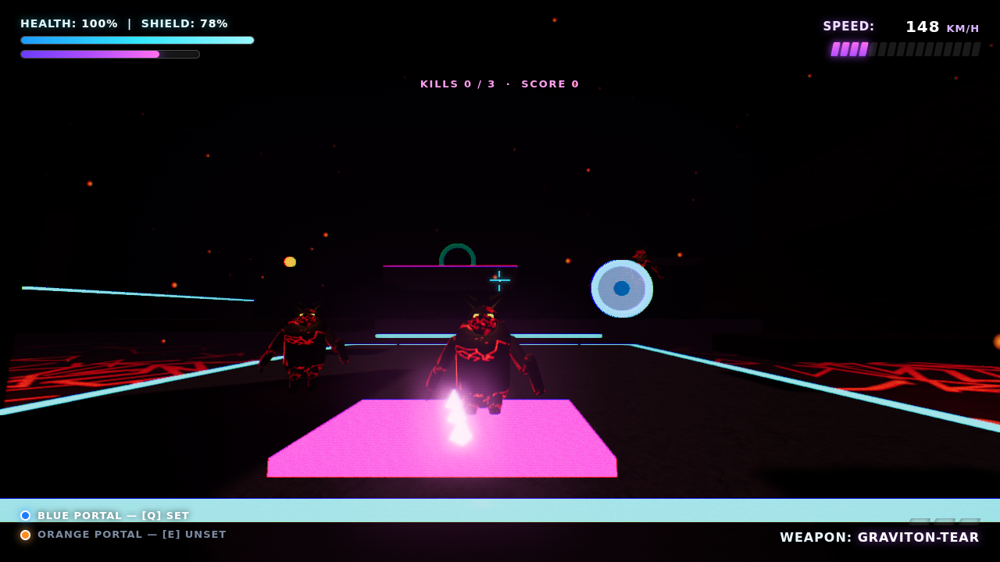

# GRAVITON — Portal · Sonic · Doom

A neon, high-velocity first-person action game that fuses three classics:

- **Portal** — tear reality open with a blue/orange portal pair and keep your momentum through the rift.
- **Sonic** — boost pads, double-jumps and rails fling you across a collapsing industrial sector at 400+ km/h.
- **Doom** — rip through a horde of demons with the **GRAVITON-TEAR** energy weapon over three escalating waves.

Survive the waves, then reach the extraction ring before the lava claims you.



## ▶ Play it now

The whole game is a **single, self-contained WebGL page** — no build step, no install, no CDN.

**Option A — open locally**
```bash
git clone https://github.com/andrewwolfson12-coder/portal-sonic-doom.git
cd portal-sonic-doom
# any static server works; e.g.
python3 -m http.server 8000
# then open http://localhost:8000/
```
(Open via a server, not `file://`, so the ES-module import of Three.js resolves.)

**Option B — GitHub Pages**
Enable Pages for this repo (Settings → Pages → Deploy from branch → root) and play at
`https://andrewwolfson12-coder.github.io/portal-sonic-doom/`.

## Controls

| Action | Key / Input |
| --- | --- |
| Move | `W` `A` `S` `D` |
| Look | Mouse (click to lock the cursor) |
| Jump / Double-jump | `Space` |
| Sprint boost | `Shift` |
| Fire Graviton-Tear | Left Mouse |
| Place **Blue** portal | `Q` |
| Place **Orange** portal | `E` |

Mobile/touch is supported too: left virtual stick to move, drag the right side to aim, on-screen FIRE / JUMP / PORTAL buttons.

## Mechanics

- **Momentum portals** — aim at any metal wall, drop a blue and an orange portal, and dive through. Your velocity is rotated to the exit and preserved, so portals double as speed tricks.
- **Boost pads** — the glowing magenta chevrons launch you along their arrows; chain them across the lava gaps.
- **Speed HUD** — the top-right gauge reads out your real velocity in km/h; boost pads push you past 400.
- **Combat** — the Graviton-Tear fires energy projectiles on a small ammo cell that recharges. Landing kills tops up your shield.
- **Waves & extraction** — clear all three demon waves to bring the extraction ring online, then stand in it to win. Fall in the lava and you die.

## Visuals

The game aims for a moody, cinematic, "realistic-but-hellish" look — entirely from code, no image/model files shipped:

- **Cinematic post-processing** — a full `EffectComposer` chain: ACES tone-mapping, **UnrealBloom** for the neon/lava glow, a custom atmosphere pass (film grain, edge vignette, chromatic aberration, a low-HP red pulse that warps the screen), and FXAA.
- **Procedural PBR textures** — worn brushed-metal panels with rivets and rust, pitted cracked concrete, and molten magma — each generated on a canvas at load with matching **normal maps** derived from a heightfield, so surfaces catch light with real relief.
- **Scary demons** — built from geometry: hunched charred bodies with glowing lava-vein skin (emissive map), horned skulls, fangs, clawed arms and digitigrade legs, with a stalking gait, head-tracking and a lunge on attack.
- **Atmosphere** — thick fog, hundreds of rising embers, flickering fire/failing-neon lights, animated flowing lava, and a continuous sub-bass dread drone.

## Tech

- [Three.js](https://threejs.org) r161 (MIT), **vendored** under `vendor/` (core + the post-processing modules) so the game runs fully offline — no CDN.
- Hand-rolled FPS controller with swept AABB collision, Quake-style acceleration, double-jump and portal teleport math.
- Procedural Web-Audio SFX and ambient drone — no audio asset files required.
- Everything — geometry, textures, lighting, particles, HUD, demons, audio — is generated in code in `index.html`.

## Repository layout

- `index.html` — the complete game (rendering, physics, portals, combat, HUD, audio).
- `vendor/three.module.js` — vendored Three.js runtime (MIT, see `vendor/three.LICENSE`).
- `Assets/Scripts/*.cs` — the original Unity/URP port of the core mechanics (PlayerController, PortalTeleporter, Weapon, SimpleEnemy, …), kept as an engine-agnostic reference. See `UNITY_SETUP.md` / `BUILD_INSTRUCTIONS.md`.
- `PROJECT_PLAN.md` — the original milestone plan.

## License

Game code: MIT (see `LICENSE`). Three.js: MIT (see `vendor/three.LICENSE`).

Owner: andrewwolfson12-coder
